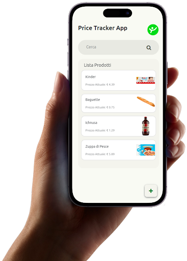

<!-- markdownlint-disable -->

# I Miei PCTO

I PCTO più significativi del triennio

---

# Syscons

## Qual era il mio compito?

L’azienda ci ha formato allo sviluppo low-code/no-code per farci sviluppare in autonomia un’app multipiattaforma che permetta di tracciare i prezzi nel tempo di prodotti forniti dall’utente.

## Cosa mi ha lasciato?

Nonostante consideri le piattaforme come SAP delle ottime alternative allo sviluppo tradizionale, ho capito che l’approccio LCNC non fa per me.

---

# FindMyTutor

## Perché l’ho scelto?

Inizialmente FindMyTutor è servito da servizio extrassociativo per il mio percorso scoutistico, ma con gli anni, le poche ore settimanali, sono diventate quasi un momento di svago.

## Cosa mi ha lasciato?

Questi 3 anni mi hanno sicuramente lasciato la voglia e il piacere nell’insegnamento e la capacità di comprendere più da vicino le difficoltà degli altri.

---
layout: center
class: text-center
---

# Grazie del vostro tempo
